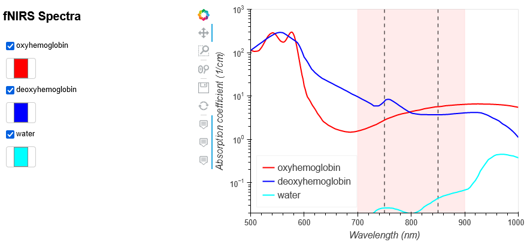

# spectra
spectra of blood, water, and maybe some other fun things

## Why?
>"[Function near infrared spectroscopy (fNIRS)](https://en.wikipedia.org/wiki/Functional_near-infrared_spectroscopy) is an optical brain monitoring technique which uses near-infrared spectroscopy for the purpose of functional neuroimaging."

When communicating about fNIRS, it's very helpful to have a nice plot to show how oxyhemoglobin and deoxyhemoglobin (the two primary target molecules) absorb different wavelengths of light around the near-infrared range. 

The spectrum for water is included to demonstrate how there is an upper limit to the 'optical window' (light red vertical span) because water starts absorbing too much light at higher wavelengths.

The two vertical dashed black lines are the central wavelengths typically used by light sources to target oxyhemoglobin and deoxyhemoglobin separately.


->[Interact with the plot in your browser](https://droumis.github.io/spectra/)
(*If this doesn't work, use the jupyer notebook in this repo for the fully interactive and customizeable version*)



_____
## Blood Data 
...is aggregated by [Scott Prahl](https://omlc.org/spectra/hemoglobin/summary.html), as explained by him below:

Tabulated Molar Extinction Coefficient for Hemoglobin in Water  
These values for the molar extinction coefficient e in [cm-1/(moles/liter)] were compiled by Scott Prahl using data from  
- W. B. Gratzer, Med. Res. Council Labs, Holly Hill, London
- N. Kollias, Wellman Laboratories, Harvard Medical School, Boston  
  
To convert this data to absorbance A, multiply by the molar concentration and the pathlength. For example, if x is the number of grams per liter and a 1 cm cuvette is being used, then the absorbance is given by

```
        (e) [(1/cm)/(moles/liter)] (x) [g/liter] (1) [cm]
  A =  ---------------------------------------------------
                          64,500 [g/mole]
```  
using 64,500 as the gram molecular weight of hemoglobin.  
To convert this data to absorption coefficient in (cm-1), multiply by the molar concentration and 2.303,

       µa = (2.303) e (x g/liter)/(64,500 g Hb/mole)
where x is the number of grams per liter. A typical value of x for whole blood is x=150 g Hb/liter.


_____
## Water Data
... is also aggregated by [Scott Prahl](https://omlc.org/spectra/water/abs/index.html) from:
- D. J. Segelstein, "The complex refractive index of water," University of Missouri-Kansas City, (1981).
- S. G. Warren, "Optical constants of ice from the ultraviolet to the microwave," Appl. Opt.,23, 1026-1225, (1984).
